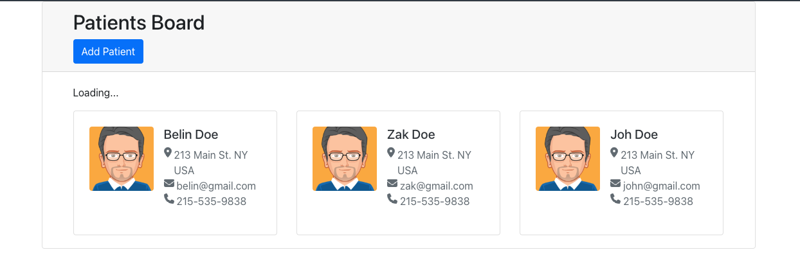

# Patient Monitoring Application - Frontend

## Overview

This repository contains the frontend code for the Patient Monitoring Application. It is built using React and TypeScript, providing a user-friendly interface for viewing patient information. The application is styled using Bootstrap for responsive design.

## Features

- **Display Patient Data**: Fetch and display a list of patients with their details.
- **Responsive Design**: Adapted for both desktop and mobile views.
- **User Interface**: Utilizes Bootstrap for modern UI components.

## Screenshot



## Installation

To get started with the frontend application, follow these steps:

### Prerequisites

- Node.js (>= 14.0.0)
- npm or yarn

### Clone the Repository

```bash
git clone https://github.com/your-username/patient-monitoring-frontend.git
cd patient-monitoring-frontend
```
